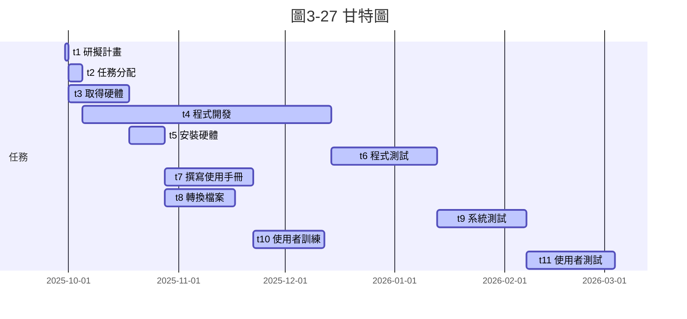

```mermaid
gantt
    title 圖3-27 甘特圖
    dateFormat  YYYY-MM-DD
    axisFormat  %Y-%m-%d

    section 任務
    t1 研擬計畫          :active, t1, 2025-09-30, 1d
    t2 任務分配          :active, t2, after t1, 4d
    t3 取得硬體          :active, t3, after t1, 17d
    t4 程式開發          :active, t4, after t2, 70d
    t5 安裝硬體          :active, t5, after t3, 10d
    t6 程式測試          :active, t6, after t4, 30d
    t7 撰寫使用手冊      :active, t7, after t5, 25d
    t8 轉換檔案          :active, t8, after t5, 20d
    t9 系統測試          :active, t9, after t6, 25d
    t10 使用者訓練       :active, t10, after t7, 20d
    t11 使用者測試       :active, t11, after t9, 25d
```
